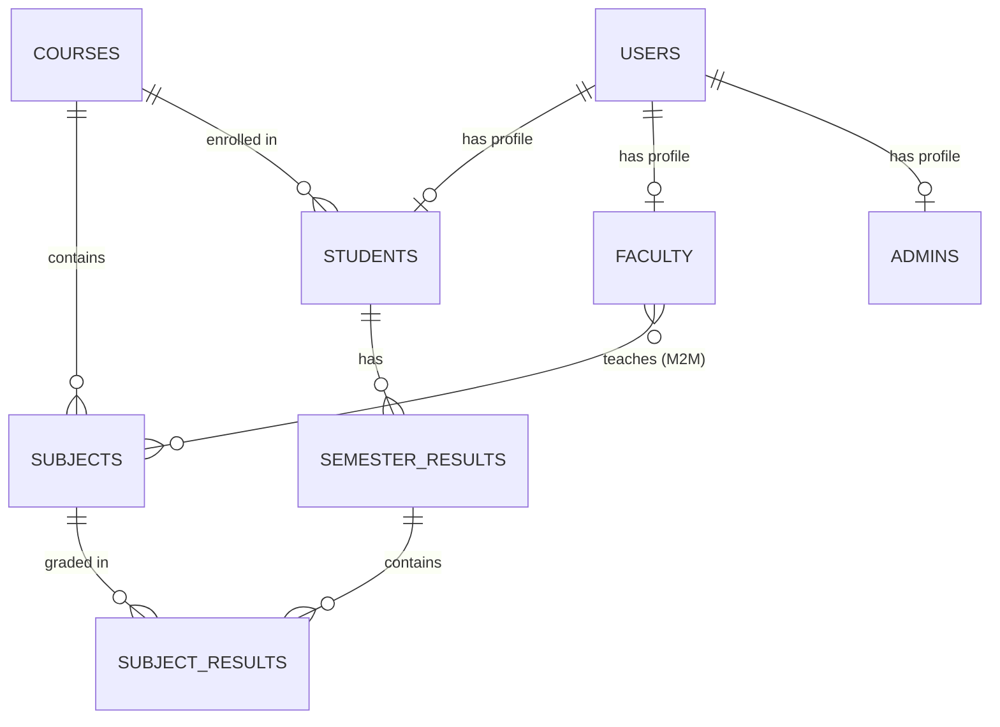
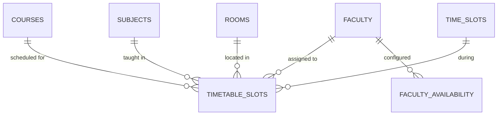
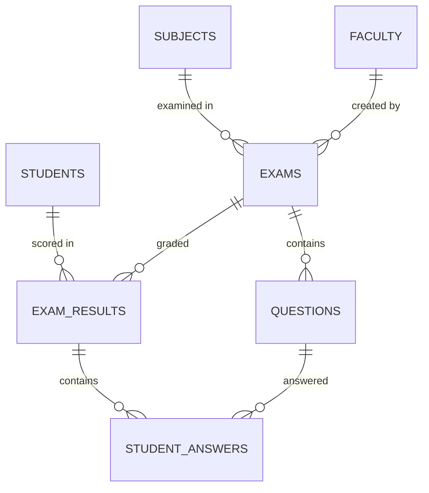
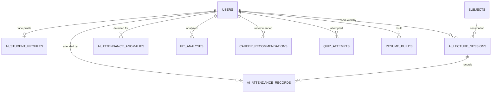

# 📊 GUNI Academic Portal — Database Documentation (PPT-Ready)

> **Project:** Ganpat University AMPICS Academic Management System
> **Database:** PostgreSQL | **Framework:** Django 5.2 + React
> **Core Tables for Diagrams:** 28 | **Total Tables in System:** 41 + 11 system

---

## 📑 Table of Contents

1. [Core Tables for ER & DFD (28 Tables)](#1-core-tables-for-er--dfd-28-tables)
2. [Detailed Data Dictionary](#2-detailed-data-dictionary)
3. [ER Diagram Strategy (Module-wise)](#3-er-diagram-strategy-module-wise)
4. [DFD — Level 0 and Level 1](#4-dfd--level-0-and-level-1)
5. [Draw.io XML — Module-wise ER Diagrams](#5-drawio-xml--module-wise-er-diagrams)
6. [Claude AI Prompts (PPT-Ready)](#6-claude-ai-prompts-ppt-ready)

---

## 1. Core Tables for ER & DFD (28 Tables)

### Module 1 — Users & Profiles (5 tables)

| # | Table Name | Description |
|---|-----------|-------------|
| 1 | `users` | Central auth table (email login, role, JWT) |
| 2 | `students` | Student profile (enrollment, course, CGPA) |
| 3 | `faculty` | Faculty profile (employee ID, department) |
| 4 | `admins` | Super-admin profile |
| 5 | `ai_student_profiles` | AI face-registration profile |

### Module 2 — Academics & Results (4 tables)

| # | Table Name | Description |
|---|-----------|-------------|
| 6 | `courses` | Degree programs (BCA, MCA, BSC-IT…) |
| 7 | `subjects` | Subjects per course/semester |
| 8 | `semester_results` | Student SGPA per semester |
| 9 | `subject_results` | Per-subject marks and grades |

### Module 3 — Smart Timetable (5 tables)

| # | Table Name | Description |
|---|-----------|-------------|
| 10 | `rooms` | Classrooms, labs, seminar halls |
| 11 | `time_slots` | Period definitions (start/end times) |
| 12 | `timetable_slots` | Actual timetable entries (subject + faculty + room) |
| 13 | `faculty_availability` | Day-wise faculty availability |
| 14 | `timetable_schedules` | Term-level schedule containers |

### Module 4 — Examinations (5 tables)

| # | Table Name | Description |
|---|-----------|-------------|
| 15 | `exams` | Exam metadata (subject, date, marks) |
| 16 | `questions` | MCQ/Short/Long questions per exam |
| 17 | `exam_results` | Student's exam score |
| 18 | `student_answers` | Individual question responses |
| 19 | `generated_paper` | AI/ML-generated exam papers (JSON) |

### Module 5 — AI Attendance (3 tables)

| # | Table Name | Description |
|---|-----------|-------------|
| 20 | `ai_lecture_sessions` | Class sessions with QR tokens |
| 21 | `ai_attendance_records` | Per-student attendance entries |
| 22 | `ai_attendance_anomalies` | AI-detected attendance anomalies |

### Module 6 — AI Career Guidance (6 tables)

| # | Table Name | Description |
|---|-----------|-------------|
| 23 | `fit_analyses` | Resume-job fit analysis |
| 24 | `career_recommendations` | AI career path suggestions |
| 25 | `quiz_attempts` | Skill-assessment quiz scores |
| 26 | `learning_resources` | Recommended learning materials |
| 27 | `internship_searches` | Internship search results |
| 28 | `resume_builds` | Resume builder submissions |

### Excluded from Diagrams (13 config/utility tables)

| Table | Reason for Exclusion |
|-------|---------------------|
| `shifts` | Background timetable config |
| `break_slots` | Break time config |
| `day_types` | Day classification config |
| `timetable_templates` | Template storage |
| `timetable_conflicts` | Conflict log |
| `semester_config` | Global toggle config |
| `academic_terms` | Term date config |
| `holidays` | Holiday calendar |
| `notifications` | System notification log |
| `career_sessions` | Session tracking |
| `ai_face_encodings` | Internal AI weight storage |
| `ai_attendance_notifications` | Notification sub-log |
| `faculty_subjects` | M2M junction (shown as relationship line) |

---

## 2. Detailed Data Dictionary

### Table 1: `users`

| Column | Data Type | Key | Null | Default | Description |
|--------|----------|-----|------|---------|-------------|
| user_id | UUID | **PK** | ✗ | uuid4() | Unique user identifier |
| email | VARCHAR(254) | **UQ** | ✗ | — | Login email |
| password | VARCHAR(128) | | ✗ | — | Hashed password |
| role | VARCHAR(10) | | ✗ | 'student' | student / faculty / admin |
| is_active | BOOLEAN | | ✗ | TRUE | Account active flag |
| is_staff | BOOLEAN | | ✗ | FALSE | Django admin access |
| created_at | TIMESTAMP | | ✗ | auto | Record creation |
| updated_at | TIMESTAMP | | ✗ | auto | Last update |

---

### Table 2: `students`

| Column | Data Type | Key | Null | Default | Description |
|--------|----------|-----|------|---------|-------------|
| student_id | UUID | **PK** | ✗ | uuid4() | Unique student ID |
| user_id | UUID | **FK→users** | ✗ | — | One-to-one auth link |
| enrollment_no | VARCHAR(20) | **UQ** | ✗ | — | Enrollment number |
| name | VARCHAR(100) | | ✗ | — | Full name |
| email | VARCHAR(254) | | ✗ | — | Student email |
| phone | VARCHAR(15) | | ✓ | — | Contact number |
| course_id | UUID | **FK→courses** | ✓ | — | Enrolled course |
| semester | INT | | ✗ | 1 | Current semester |
| current_semester | INT | | ✗ | 1 | Active semester |
| total_semesters | INT | | ✗ | 6 | Course duration |
| cgpa | DECIMAL(4,2) | | ✗ | 0.00 | Cumulative GPA |
| status | VARCHAR(20) | | ✗ | 'Active' | Active / Inactive |
| is_face_registered | BOOLEAN | | ✗ | FALSE | AI face status |
| date_of_birth | DATE | | ✓ | — | DOB |
| gender | VARCHAR(10) | | ✓ | — | Gender |
| father_name | VARCHAR(100) | | ✓ | — | Father's name |
| address | TEXT | | ✓ | — | Address |
| batch | VARCHAR(2) | | ✓ | — | Batch A / B |
| admission_year | INT | | ✗ | 2026 | Admission year |
| branch | VARCHAR(100) | | ✓ | — | Campus branch |
| created_at | TIMESTAMP | | ✗ | auto | Record creation |
| updated_at | TIMESTAMP | | ✗ | auto | Last update |

---

### Table 3: `faculty`

| Column | Data Type | Key | Null | Default | Description |
|--------|----------|-----|------|---------|-------------|
| faculty_id | UUID | **PK** | ✗ | uuid4() | Unique faculty ID |
| user_id | UUID | **FK→users** | ✗ | — | One-to-one auth link |
| employee_id | VARCHAR(20) | **UQ** | ✗ | — | Employee ID |
| name | VARCHAR(100) | | ✗ | — | Full name |
| email | VARCHAR(254) | | ✗ | — | Faculty email |
| phone | VARCHAR(15) | | ✓ | — | Contact number |
| department | VARCHAR(50) | | ✗ | — | Department |
| status | VARCHAR(20) | | ✗ | 'Active' | Status |
| is_class_teacher | BOOLEAN | | ✗ | FALSE | Class teacher flag |
| is_hod | BOOLEAN | | ✗ | FALSE | HOD flag |
| class_course_id | UUID | **FK→courses** | ✓ | — | Class teacher course |
| class_semester | INT | | ✓ | 1 | Class teacher semester |
| working_shift | VARCHAR(20) | | ✗ | 'Noon' | Working shift |
| max_lectures_per_day | INT | | ✗ | 6 | Daily lecture cap |
| designation | VARCHAR(50) | | ✓ | — | HOD / Professor etc. |
| qualification | VARCHAR(100) | | ✓ | — | Qualification |
| experience_years | INT | | ✗ | 0 | Experience |
| branch | VARCHAR(100) | | ✓ | — | Campus branch |
| created_at | TIMESTAMP | | ✗ | auto | Record creation |
| updated_at | TIMESTAMP | | ✗ | auto | Last update |

---

### Table 4: `admins`

| Column | Data Type | Key | Null | Default | Description |
|--------|----------|-----|------|---------|-------------|
| admin_id_pk | UUID | **PK** | ✗ | uuid4() | Internal PK |
| user_id | UUID | **FK→users** | ✗ | — | One-to-one auth link |
| admin_id | VARCHAR(20) | **UQ** | ✗ | — | Admin display ID |
| name | VARCHAR(100) | | ✗ | — | Full name |
| email | VARCHAR(254) | | ✗ | — | Admin email |
| phone | VARCHAR(15) | | ✓ | — | Contact number |
| created_at | TIMESTAMP | | ✗ | auto | Record creation |
| updated_at | TIMESTAMP | | ✗ | auto | Last update |

---

### Table 5: `ai_student_profiles`

| Column | Data Type | Key | Null | Default | Description |
|--------|----------|-----|------|---------|-------------|
| id | INT | **PK** | ✗ | auto | Auto-increment ID |
| user_id | UUID | **FK→users** | ✗ | — | One-to-one user link |
| phone_number | VARCHAR(15) | | ✗ | '' | Student phone |
| parent_phone_number | VARCHAR(15) | | ✗ | '' | Parent phone |
| email | VARCHAR(254) | | ✗ | '' | Contact email |
| is_face_registered | BOOLEAN | | ✗ | FALSE | Face registered |
| is_details_filled | BOOLEAN | | ✗ | FALSE | Profile complete |
| face_registered_at | TIMESTAMP | | ✓ | — | Registration time |
| registered_face_photo | VARCHAR(100) | | ✓ | — | Face photo path |
| created_at | TIMESTAMP | | ✗ | auto | Timestamp |

---

### Table 6: `courses`

| Column | Data Type | Key | Null | Default | Description |
|--------|----------|-----|------|---------|-------------|
| course_id | UUID | **PK** | ✗ | uuid4() | Unique course ID |
| code | VARCHAR(20) | **UQ** | ✗ | — | Course code (BCA, MCA…) |
| name | VARCHAR(100) | | ✗ | — | Full name |
| duration | INT | | ✗ | — | Duration in years |
| total_semesters | INT | | ✗ | — | Semester count |
| department | VARCHAR(50) | | ✗ | — | Department |
| level | VARCHAR(50) | | ✓ | — | UG / PG |
| credits | INT | | ✗ | 0 | Total credits |
| status | VARCHAR(20) | | ✗ | 'Active' | Status |
| shift | VARCHAR(10) | | ✗ | 'NOON' | MORNING / NOON |
| desc | TEXT | | ✓ | — | Description |
| created_at | TIMESTAMP | | ✗ | auto | Timestamp |

---

### Table 7: `subjects`

| Column | Data Type | Key | Null | Default | Description |
|--------|----------|-----|------|---------|-------------|
| subject_id | UUID | **PK** | ✗ | uuid4() | Unique subject ID |
| code | VARCHAR(20) | **UQ** | ✗ | — | Subject code |
| name | VARCHAR(100) | | ✗ | — | Subject name |
| course_id | UUID | **FK→courses** | ✗ | — | Parent course |
| semester | INT | | ✗ | — | Semester number |
| credits | INT | | ✗ | 4 | Credits |
| campus_branch | VARCHAR(20) | | ✗ | 'Kherva' | Campus |
| created_at | TIMESTAMP | | ✗ | auto | Timestamp |

---

### Table 8: `semester_results`

| Column | Data Type | Key | Null | Default | Description |
|--------|----------|-----|------|---------|-------------|
| result_id | UUID | **PK** | ✗ | uuid4() | Unique result ID |
| student_id | UUID | **FK→students** | ✗ | — | Student ref |
| semester | INT | | ✗ | — | Semester number |
| sgpa | DECIMAL(4,2) | | ✓ | — | Semester GPA |
| total_marks | INT | | ✗ | 0 | Total possible |
| obtained_marks | INT | | ✗ | 0 | Marks obtained |
| percentage | DECIMAL(5,2) | | ✗ | 0 | Percentage |
| grade | VARCHAR(5) | | ✓ | — | Overall grade |
| status | VARCHAR(20) | | ✗ | 'remaining' | completed / remaining |
| year | INT | | ✓ | — | Academic year |
| exam_type | VARCHAR(20) | | ✓ | — | Regular / Backlog |
| remarks | TEXT | | ✓ | — | Remarks |
| created_at | TIMESTAMP | | ✗ | auto | Timestamp |
| updated_at | TIMESTAMP | | ✗ | auto | Last update |

> **Unique Constraint:** (student_id, semester)

---

### Table 9: `subject_results`

| Column | Data Type | Key | Null | Default | Description |
|--------|----------|-----|------|---------|-------------|
| subject_result_id | UUID | **PK** | ✗ | uuid4() | Unique ID |
| semester_result_id | UUID | **FK→semester_results** | ✗ | — | Parent result |
| subject_id | UUID | **FK→subjects** | ✗ | — | Subject ref |
| internal_marks | INT | | ✗ | 0 | Internal marks |
| external_marks | INT | | ✗ | 0 | External marks |
| practical_marks | INT | | ✗ | 0 | Practical marks |
| total_marks | INT | | ✗ | 0 | Total marks |
| passing_marks | INT | | ✗ | 35 | Pass threshold |
| is_passed | BOOLEAN | | ✗ | FALSE | Pass/Fail |
| grade | VARCHAR(5) | | ✓ | — | Grade |

---

### Table 10: `rooms`

| Column | Data Type | Key | Null | Default | Description |
|--------|----------|-----|------|---------|-------------|
| room_id | UUID | **PK** | ✗ | uuid4() | Unique room ID |
| room_number | VARCHAR(20) | **UQ** | ✗ | — | Room number |
| building | VARCHAR(50) | | ✗ | — | Building |
| room_type | VARCHAR(20) | | ✗ | 'Lecture Hall' | Type |
| capacity | INT | | ✗ | 60 | Capacity |
| floor | INT | | ✗ | 1 | Floor |
| campus_branch | VARCHAR(20) | | ✗ | 'Kherva' | Campus |
| has_projector | BOOLEAN | | ✗ | FALSE | Projector |
| has_computers | BOOLEAN | | ✗ | FALSE | Computers |
| is_available | BOOLEAN | | ✗ | TRUE | Available |
| created_at | TIMESTAMP | | ✗ | auto | Timestamp |

---

### Table 11: `time_slots`

| Column | Data Type | Key | Null | Default | Description |
|--------|----------|-----|------|---------|-------------|
| slot_id | UUID | **PK** | ✗ | uuid4() | Unique slot ID |
| name | VARCHAR(30) | | ✗ | — | Slot label |
| slot_order | INT | | ✗ | 0 | Sequence |
| start_time | TIME | | ✗ | — | Period start |
| end_time | TIME | | ✗ | — | Period end |
| duration_minutes | INT | | ✗ | 60 | Duration |
| is_break | BOOLEAN | | ✗ | FALSE | Break flag |
| break_type | VARCHAR(20) | | ✗ | 'None' | Break type |
| campus_branch | VARCHAR(20) | | ✗ | 'Kherva' | Campus |
| is_active | BOOLEAN | | ✗ | TRUE | Active |

---

### Table 12: `timetable_slots`

| Column | Data Type | Key | Null | Default | Description |
|--------|----------|-----|------|---------|-------------|
| slot_id | UUID | **PK** | ✗ | uuid4() | Unique entry ID |
| course_id | UUID | **FK→courses** | ✗ | — | Course |
| semester | INT | | ✗ | — | Semester |
| day_of_week | VARCHAR(10) | | ✗ | — | Day name |
| time_slot_id | UUID | **FK→time_slots** | ✓ | — | Period ref |
| start_time | TIME | | ✗ | — | Start time |
| end_time | TIME | | ✗ | — | End time |
| subject_id | UUID | **FK→subjects** | ✗ | — | Subject |
| faculty_id | UUID | **FK→faculty** | ✗ | — | Faculty |
| room_id | UUID | **FK→rooms** | ✓ | — | Room |
| room_name | VARCHAR(50) | | ✓ | — | Room label |
| section | VARCHAR(10) | | ✗ | 'A' | Section |
| slot_type | VARCHAR(20) | | ✗ | 'Theory' | Type |
| is_auto_generated | BOOLEAN | | ✗ | FALSE | AI-generated |
| generated_by | VARCHAR(20) | | ✗ | 'manual' | Method |
| priority | INT | | ✗ | 5 | Priority |
| created_at | TIMESTAMP | | ✗ | auto | Timestamp |
| updated_at | TIMESTAMP | | ✗ | auto | Last update |

> **Unique Constraint:** (course_id, semester, day_of_week, start_time, section)

---

### Table 13: `faculty_availability`

| Column | Data Type | Key | Null | Default | Description |
|--------|----------|-----|------|---------|-------------|
| availability_id | UUID | **PK** | ✗ | uuid4() | Unique ID |
| faculty_id | UUID | **FK→faculty** | ✗ | — | Faculty ref |
| day_of_week | VARCHAR(10) | | ✗ | — | Day name |
| is_available | BOOLEAN | | ✗ | TRUE | Available |
| preferred_slots | JSON | | ✗ | [] | Preferred IDs |
| not_available_slots | JSON | | ✗ | [] | Unavailable IDs |
| campus_branch | VARCHAR(20) | | ✗ | 'Kherva' | Campus |

> **Unique Constraint:** (faculty_id, day_of_week)

---

### Table 14: `timetable_schedules`

| Column | Data Type | Key | Null | Default | Description |
|--------|----------|-----|------|---------|-------------|
| schedule_id | UUID | **PK** | ✗ | uuid4() | Unique ID |
| name | VARCHAR(100) | | ✗ | — | Schedule name |
| start_date | DATE | | ✗ | — | Start date |
| end_date | DATE | | ✗ | — | End date |
| is_active | BOOLEAN | | ✗ | FALSE | Active |
| is_published | BOOLEAN | | ✗ | FALSE | Published |
| generated_by | VARCHAR(20) | | ✗ | 'manual' | Method |
| generation_log | TEXT | | ✓ | — | AI log |
| created_at | TIMESTAMP | | ✗ | auto | Timestamp |
| updated_at | TIMESTAMP | | ✗ | auto | Last update |

---

### Table 15: `exams`

| Column | Data Type | Key | Null | Default | Description |
|--------|----------|-----|------|---------|-------------|
| exam_id | UUID | **PK** | ✗ | uuid4() | Unique exam ID |
| title | VARCHAR(200) | | ✗ | — | Exam title |
| subject_id | UUID | **FK→subjects** | ✗ | — | Subject |
| exam_type | VARCHAR(20) | | ✗ | 'End Term' | Type |
| campus_branch | VARCHAR(20) | | ✗ | 'Kherva' | Campus |
| date | DATE | | ✗ | — | Exam date |
| start_time | TIME | | ✗ | — | Start time |
| duration_minutes | INT | | ✗ | 60 | Duration |
| total_marks | INT | | ✗ | 100 | Max marks |
| passing_marks | INT | | ✗ | 35 | Pass marks |
| instructions | TEXT | | ✓ | — | Instructions |
| is_published | BOOLEAN | | ✗ | FALSE | Published |
| created_by_id | UUID | **FK→faculty** | ✓ | — | Creator |
| created_at | TIMESTAMP | | ✗ | auto | Timestamp |
| updated_at | TIMESTAMP | | ✗ | auto | Last update |

---

### Table 16: `questions`

| Column | Data Type | Key | Null | Default | Description |
|--------|----------|-----|------|---------|-------------|
| question_id | UUID | **PK** | ✗ | uuid4() | Unique ID |
| exam_id | UUID | **FK→exams** | ✗ | — | Parent exam |
| question_text | TEXT | | ✗ | — | Question |
| question_type | VARCHAR(10) | | ✗ | 'MCQ' | MCQ/Short/Long |
| marks | INT | | ✗ | 5 | Marks |
| options | JSON | | ✓ | — | MCQ options |
| correct_answer | TEXT | | ✓ | — | Answer key |
| order | INT | | ✗ | 0 | Display order |
| created_at | TIMESTAMP | | ✗ | auto | Timestamp |

---

### Table 17: `exam_results`

| Column | Data Type | Key | Null | Default | Description |
|--------|----------|-----|------|---------|-------------|
| result_id | UUID | **PK** | ✗ | uuid4() | Unique ID |
| student_id | UUID | **FK→students** | ✗ | — | Student |
| exam_id | UUID | **FK→exams** | ✗ | — | Exam |
| marks_obtained | DECIMAL(6,2) | | ✗ | 0 | Score |
| is_absent | BOOLEAN | | ✗ | FALSE | Absent |
| is_rechecked | BOOLEAN | | ✗ | FALSE | Rechecked |
| recheck_status | VARCHAR(20) | | ✓ | — | Status |
| feedback | TEXT | | ✓ | — | Feedback |
| created_at | TIMESTAMP | | ✗ | auto | Timestamp |
| updated_at | TIMESTAMP | | ✗ | auto | Last update |

> **Unique Constraint:** (student_id, exam_id)

---

### Table 18: `student_answers`

| Column | Data Type | Key | Null | Default | Description |
|--------|----------|-----|------|---------|-------------|
| answer_id | UUID | **PK** | ✗ | uuid4() | Unique ID |
| exam_result_id | UUID | **FK→exam_results** | ✗ | — | Result ref |
| question_id | UUID | **FK→questions** | ✗ | — | Question ref |
| answer_text | TEXT | | ✓ | — | Written answer |
| selected_option | VARCHAR(500) | | ✓ | — | MCQ selection |
| is_correct | BOOLEAN | | ✗ | FALSE | Correct flag |
| marks_obtained | DECIMAL(5,2) | | ✗ | 0 | Marks |
| created_at | TIMESTAMP | | ✗ | auto | Timestamp |

---

### Table 19: `generated_paper` (AI Exam Paper Generator)

| Column | Data Type | Key | Null | Default | Description |
|--------|----------|-----|------|---------|-------------|
| id | INT | **PK** | ✗ | auto | Auto ID |
| semester | INT | | ✗ | — | Semester |
| subject_code | VARCHAR(50) | | ✗ | — | Subject code |
| subject_name | VARCHAR(150) | | ✗ | — | Subject name |
| exam_type | VARCHAR(50) | | ✗ | — | Exam type |
| total_marks | INT | | ✗ | 60 | Total marks |
| paper_data | JSON | | ✓ | — | Full generated paper |
| created_at | TIMESTAMP | | ✗ | auto | Timestamp |

---

### Table 20: `ai_lecture_sessions`

| Column | Data Type | Key | Null | Default | Description |
|--------|----------|-----|------|---------|-------------|
| id | INT | **PK** | ✗ | auto | Auto ID |
| subject_id | UUID | **FK→subjects** | ✗ | — | Subject |
| faculty_id | UUID | **FK→users** | ✗ | — | Faculty user |
| date | DATE | | ✗ | — | Session date |
| start_time | TIME | | ✗ | — | Start time |
| end_time | TIME | | ✗ | — | End time |
| total_students | INT | | ✗ | 0 | Expected count |
| session_type | VARCHAR(20) | | ✗ | 'lecture' | Type |
| is_active | BOOLEAN | | ✗ | TRUE | Active |
| qr_token | UUID | **UQ** | ✗ | uuid4() | QR token |
| qr_expires_at | TIMESTAMP | | ✓ | — | QR expiry |
| qr_image_path | VARCHAR(500) | | ✗ | '' | QR image |
| created_at | TIMESTAMP | | ✗ | auto | Timestamp |

---

### Table 21: `ai_attendance_records`

| Column | Data Type | Key | Null | Default | Description |
|--------|----------|-----|------|---------|-------------|
| id | INT | **PK** | ✗ | auto | Auto ID |
| session_id | INT | **FK→ai_lecture_sessions** | ✗ | — | Session |
| student_id | UUID | **FK→users** | ✗ | — | Student |
| status | VARCHAR(20) | | ✗ | 'absent' | present/absent/late |
| marked_via | VARCHAR(20) | | ✗ | 'manual' | qr/face/manual |
| confidence_score | FLOAT | | ✓ | — | Confidence 0-100 |
| snapshot_path | VARCHAR(500) | | ✓ | — | Snapshot |
| marked_at | TIMESTAMP | | ✗ | auto | Mark time |
| ip_address | VARCHAR(45) | | ✗ | '' | Student IP |

> **Unique Constraint:** (session_id, student_id)

---

### Table 22: `ai_attendance_anomalies`

| Column | Data Type | Key | Null | Default | Description |
|--------|----------|-----|------|---------|-------------|
| id | INT | **PK** | ✗ | auto | Auto ID |
| student_id | UUID | **FK→users** | ✗ | — | Student |
| subject_id | UUID | **FK→subjects** | ✗ | — | Subject |
| anomaly_type | VARCHAR(30) | | ✗ | — | Type of anomaly |
| severity | VARCHAR(20) | | ✗ | 'medium' | Severity level |
| description | TEXT | | ✗ | '' | LLM-generated alert |
| detected_at | TIMESTAMP | | ✗ | auto | Detection time |
| is_resolved | BOOLEAN | | ✗ | FALSE | Resolved flag |
| resolved_at | TIMESTAMP | | ✓ | — | Resolution time |

---

### Table 23: `fit_analyses`

| Column | Data Type | Key | Null | Default | Description |
|--------|----------|-----|------|---------|-------------|
| id | INT | **PK** | ✗ | auto | Auto ID |
| user_id | UUID | **FK→users** | ✓ | — | User |
| match_score | FLOAT | | ✗ | — | Match score |
| fit_prediction | VARCHAR(50) | | ✗ | — | Prediction |
| fit_confidence | FLOAT | | ✗ | — | Confidence |
| matched_skills | JSON | | ✗ | [] | Matched skills |
| missing_skills | JSON | | ✗ | [] | Missing skills |
| resume_preview | TEXT | | ✗ | — | Resume snippet |
| job_preview | TEXT | | ✗ | — | Job snippet |
| model_type | VARCHAR(20) | | ✗ | 'local' | ML model |
| created_at | TIMESTAMP | | ✗ | auto | Timestamp |

---

### Table 24: `career_recommendations`

| Column | Data Type | Key | Null | Default | Description |
|--------|----------|-----|------|---------|-------------|
| id | INT | **PK** | ✗ | auto | Auto ID |
| user_id | UUID | **FK→users** | ✓ | — | User |
| interests | JSON | | ✗ | [] | Interests |
| current_skills | TEXT | | ✗ | — | Skills |
| experience | VARCHAR(50) | | ✗ | — | Experience |
| recommendations | JSON | | ✗ | [] | AI outputs |
| ai_generated | BOOLEAN | | ✗ | FALSE | AI flag |
| created_at | TIMESTAMP | | ✗ | auto | Timestamp |

---

### Table 25: `quiz_attempts`

| Column | Data Type | Key | Null | Default | Description |
|--------|----------|-----|------|---------|-------------|
| id | INT | **PK** | ✗ | auto | Auto ID |
| user_id | UUID | **FK→users** | ✓ | — | User |
| skills_tested | JSON | | ✗ | [] | Skills |
| total_questions | INT | | ✗ | — | Questions |
| correct_answers | INT | | ✗ | — | Correct |
| score_percent | FLOAT | | ✗ | — | Score % |
| grade | VARCHAR(10) | | ✗ | — | Grade |
| ai_generated | BOOLEAN | | ✗ | FALSE | AI flag |
| created_at | TIMESTAMP | | ✗ | auto | Timestamp |

---

### Table 26: `learning_resources`

| Column | Data Type | Key | Null | Default | Description |
|--------|----------|-----|------|---------|-------------|
| id | INT | **PK** | ✗ | auto | Auto ID |
| user_id | UUID | **FK→users** | ✓ | — | User |
| skill_name | VARCHAR(100) | | ✗ | — | Skill |
| resources | JSON | | ✗ | [] | Resource list |
| ai_generated | BOOLEAN | | ✗ | FALSE | AI flag |
| created_at | TIMESTAMP | | ✗ | auto | Timestamp |

---

### Table 27: `internship_searches`

| Column | Data Type | Key | Null | Default | Description |
|--------|----------|-----|------|---------|-------------|
| id | INT | **PK** | ✗ | auto | Auto ID |
| user_id | UUID | **FK→users** | ✓ | — | User |
| field | VARCHAR(100) | | ✗ | — | Search field |
| location | VARCHAR(100) | | ✗ | '' | Location |
| results | JSON | | ✗ | [] | Results |
| ai_generated | BOOLEAN | | ✗ | FALSE | AI flag |
| created_at | TIMESTAMP | | ✗ | auto | Timestamp |

---

### Table 28: `resume_builds`

| Column | Data Type | Key | Null | Default | Description |
|--------|----------|-----|------|---------|-------------|
| id | INT | **PK** | ✗ | auto | Auto ID |
| user_id | UUID | **FK→users** | ✓ | — | User |
| personal_info | JSON | | ✗ | {} | Personal info |
| education | JSON | | ✗ | [] | Education |
| experience | JSON | | ✗ | [] | Experience |
| skills | JSON | | ✗ | [] | Skills |
| resume_format | VARCHAR(10) | | ✗ | — | Format |
| created_at | TIMESTAMP | | ✗ | auto | Timestamp |

---

## 3. ER Diagram Strategy (Module-wise)

> **PPT Recommendation:** Create **4 separate ER slides** instead of one cluttered diagram.

### Slide 1: Master ER — Core Entities (10 tables)



### Slide 2: Timetable & Scheduling ER (5 tables)



### Slide 3: Examinations ER (5 tables)



### Slide 4: AI Modules ER (9 tables)



---

## 4. DFD — Level 0 and Level 1

### Level-0 Context Diagram

```
┌─────────┐                                              ┌──────────┐
│         │── Credentials / OAuth Token ──────────────►   │          │
│ Student │◄── Dashboard, Results, Timetable ──────────   │          │
│         │── Face Image, QR Scan ────────────────────►   │          │
│         │◄── Attendance Status, Career Recs ─────────   │          │
└─────────┘                                               │   GUNI   │
                                                          │ Academic │
┌─────────┐                                               │  Portal  │
│         │── Login, Exam Papers, Grades ─────────────►   │  System  │
│ Faculty │◄── Timetable, Reports, Alerts ─────────────   │          │
│         │                                               │          │
└─────────┘                                               │          │
                                                          │          │
┌─────────┐                                               │          │
│  Admin  │── User CRUD, Course Config ───────────────►   │          │
│ (Super) │◄── Analytics, System Logs ─────────────────   │          │
└─────────┘                                               └──────┬───┘
                                                                 │
                                              ┌──────────────────┼──────────────────┐
                                              │                  │                  │
                                         ┌────▼────┐       ┌────▼────┐       ┌─────▼────┐
                                         │ Google  │       │  Gmail  │       │PostgreSQL│
                                         │  OAuth  │       │  SMTP   │       │    DB    │
                                         └─────────┘       └─────────┘       └──────────┘
```

### Level-1 DFD — Processes

| ID | Process | Inputs | Outputs | Data Stores |
|----|---------|--------|---------|-------------|
| P1 | **User Authentication** | Email+Password / Google OAuth token | JWT token, session | D1: users |
| P2 | **Student Management** | Student data (CRUD by Admin) | Student records, welcome email | D1: users, students |
| P3 | **Faculty Management** | Faculty data (CRUD by Admin) | Faculty records, welcome email | D1: users, faculty |
| P4 | **Course & Subject Management** | Course/subject config | Curriculum data | D2: courses, subjects |
| P5 | **AI Timetable Generation** | Courses, faculty, rooms, availability | Timetable slots | D3: timetable_slots, rooms, time_slots |
| P6 | **Result Processing** | Internal + External marks | SGPA, CGPA, grades | D4: semester_results, subject_results |
| P7 | **Exam Management** | Exam config, questions | Published exams, results | D5: exams, questions, exam_results |
| P8 | **AI Paper Generation** | Subject code, semester, PYQ data | Generated paper PDF/JSON | D6: generated_paper |
| P9 | **AI Attendance** | Face images, QR scan | Attendance records | D7: ai_lecture_sessions, ai_attendance_records |
| P10 | **Anomaly Detection** | Attendance patterns | Anomaly alerts | D8: ai_attendance_anomalies |
| P11 | **AI Career Guidance** | Resume, skills, interests | Recommendations, quiz, internships | D9: fit_analyses, career_recommendations |
| P12 | **Email & Notification** | System events | Emails, push notifications | Gmail SMTP |

### Level-1 DFD — Data Flows

```
┌─────────┐     credentials      ┌────┐    JWT token     ┌─────────┐
│ Student │─────────────────────►│ P1 │──────────────────►│ Student │
│ Faculty │─────────────────────►│Auth│──────────────────►│ Faculty │
│  Admin  │─────────────────────►│    │──────────────────►│  Admin  │
└─────────┘                      └──┬─┘                   └─────────┘
                                    │ read/write
                                    ▼
                              ═══[D1: users]═══

┌─────────┐   student data    ┌────┐   student record   ┌─────────┐
│  Admin  │──────────────────►│ P2 │────────────────────►│ Student │
└─────────┘                   └──┬─┘                     └─────────┘
                                 │ write                       ▲
                                 ▼                             │ welcome email
                          ═══[D1: students]═══           ┌────┴────┐
                                                         │P12 Email│
                                                         └─────────┘

┌─────────┐   course config   ┌────┐   curriculum       ═══[D2: courses]═══
│  Admin  │──────────────────►│ P4 │────────────────────►═══[D2: subjects]═══
└─────────┘                   └────┘

┌─────────┐   trigger gen     ┌────┐   timetable slots  ═══[D3: timetable_slots]═══
│  Admin  │──────────────────►│ P5 │◄───────────────────═══[D3: rooms, time_slots]═══
└─────────┘                   └──┬─┘
                                 │ read faculty avail
                                 ▼
                          ═══[D3: faculty_availability]═══

┌─────────┐   marks/grades    ┌────┐   SGPA/CGPA        ═══[D4: semester_results]═══
│ Faculty │──────────────────►│ P6 │────────────────────►═══[D4: subject_results]═══
└─────────┘                   └────┘

┌─────────┐   exam/questions  ┌────┐   results          ═══[D5: exams, questions]═══
│ Faculty │──────────────────►│ P7 │────────────────────►═══[D5: exam_results]═══
└─────────┘                   └──┬─┘
                                 │ answers
                                 ▼
                          ═══[D5: student_answers]═══

┌─────────┐   subject+sem     ┌────┐   paper JSON       ═══[D6: generated_paper]═══
│ Faculty │──────────────────►│ P8 │────────────────────►
└─────────┘                   └────┘

┌─────────┐   face/QR         ┌────┐   attendance       ═══[D7: ai_attendance_records]═══
│ Student │──────────────────►│ P9 │────────────────────►
│ Faculty │── session config ─►│    │◄──────────────────═══[D7: ai_lecture_sessions]═══
└─────────┘                   └──┬─┘
                                 │ pattern data
                                 ▼
                              ┌────┐   anomalies        ═══[D8: ai_attendance_anomalies]═══
                              │P10 │────────────────────►
                              └────┘

┌─────────┐   resume/skills   ┌────┐   recommendations  ═══[D9: fit_analyses]═══
│ Student │──────────────────►│P11 │────────────────────►═══[D9: career_recommendations]═══
└─────────┘                   └────┘                     ═══[D9: quiz_attempts, etc.]═══
```

---

## 5. Draw.io XML — Module-wise ER Diagrams

### How to Import

1. Open [https://app.diagrams.net/](https://app.diagrams.net/)
2. **Extras → Edit Diagram** (Ctrl+Shift+X)
3. Paste the XML below → Click **OK**

### Slide 1: Core Entities ER (Users + Academics)

```xml
<mxGraphModel dx="1422" dy="762" grid="1" gridSize="10" guides="1" tooltips="1" connect="1" arrows="1" fold="1" page="1" pageScale="1" pageWidth="1600" pageHeight="900">
  <root>
    <mxCell id="0"/>
    <mxCell id="1" parent="0"/>
    <mxCell id="u" value="users" style="shape=table;startSize=30;container=1;collapsible=0;childLayout=tableLayout;fixedRows=1;rowLines=0;fontStyle=1;align=center;resizeLast=1;fillColor=#dae8fc;strokeColor=#6c8ebf;fontSize=14;" vertex="1" parent="1"><mxGeometry x="560" y="40" width="240" height="130" as="geometry"/></mxCell>
    <mxCell id="u1" value="PK  user_id : UUID" style="text;strokeColor=none;fillColor=none;align=left;verticalAlign=middle;spacingLeft=4;fontStyle=1;" vertex="1" parent="u"><mxGeometry y="30" width="240" height="20" as="geometry"/></mxCell>
    <mxCell id="u2" value="     email : VARCHAR UQ&#xa;     role : student|faculty|admin&#xa;     password, is_active&#xa;     created_at, updated_at" style="text;strokeColor=none;fillColor=none;align=left;verticalAlign=top;spacingLeft=4;" vertex="1" parent="u"><mxGeometry y="50" width="240" height="80" as="geometry"/></mxCell>

    <mxCell id="s" value="students" style="shape=table;startSize=30;container=1;collapsible=0;childLayout=tableLayout;fixedRows=1;rowLines=0;fontStyle=1;align=center;resizeLast=1;fillColor=#d5e8d4;strokeColor=#82b366;fontSize=14;" vertex="1" parent="1"><mxGeometry x="160" y="40" width="280" height="150" as="geometry"/></mxCell>
    <mxCell id="s1" value="PK  student_id : UUID" style="text;strokeColor=none;fillColor=none;align=left;verticalAlign=middle;spacingLeft=4;fontStyle=1;" vertex="1" parent="s"><mxGeometry y="30" width="280" height="20" as="geometry"/></mxCell>
    <mxCell id="s2" value="FK  user_id → users (1:1)&#xa;FK  course_id → courses&#xa;     enrollment_no UQ, name, email&#xa;     semester, cgpa, batch, status&#xa;     is_face_registered" style="text;strokeColor=none;fillColor=none;align=left;verticalAlign=top;spacingLeft=4;" vertex="1" parent="s"><mxGeometry y="50" width="280" height="100" as="geometry"/></mxCell>

    <mxCell id="f" value="faculty" style="shape=table;startSize=30;container=1;collapsible=0;childLayout=tableLayout;fixedRows=1;rowLines=0;fontStyle=1;align=center;resizeLast=1;fillColor=#fff2cc;strokeColor=#d6b656;fontSize=14;" vertex="1" parent="1"><mxGeometry x="920" y="40" width="280" height="150" as="geometry"/></mxCell>
    <mxCell id="f1" value="PK  faculty_id : UUID" style="text;strokeColor=none;fillColor=none;align=left;verticalAlign=middle;spacingLeft=4;fontStyle=1;" vertex="1" parent="f"><mxGeometry y="30" width="280" height="20" as="geometry"/></mxCell>
    <mxCell id="f2" value="FK  user_id → users (1:1)&#xa;FK  class_course_id → courses&#xa;     employee_id UQ, name, department&#xa;     designation, working_shift&#xa;     is_class_teacher, is_hod" style="text;strokeColor=none;fillColor=none;align=left;verticalAlign=top;spacingLeft=4;" vertex="1" parent="f"><mxGeometry y="50" width="280" height="100" as="geometry"/></mxCell>

    <mxCell id="a" value="admins" style="shape=table;startSize=30;container=1;collapsible=0;childLayout=tableLayout;fixedRows=1;rowLines=0;fontStyle=1;align=center;resizeLast=1;fillColor=#f8cecc;strokeColor=#b85450;fontSize=14;" vertex="1" parent="1"><mxGeometry x="610" y="220" width="200" height="100" as="geometry"/></mxCell>
    <mxCell id="a1" value="PK  admin_id_pk : UUID" style="text;strokeColor=none;fillColor=none;align=left;verticalAlign=middle;spacingLeft=4;fontStyle=1;" vertex="1" parent="a"><mxGeometry y="30" width="200" height="20" as="geometry"/></mxCell>
    <mxCell id="a2" value="FK  user_id → users (1:1)&#xa;     admin_id UQ, name, email" style="text;strokeColor=none;fillColor=none;align=left;verticalAlign=top;spacingLeft=4;" vertex="1" parent="a"><mxGeometry y="50" width="200" height="50" as="geometry"/></mxCell>

    <mxCell id="c" value="courses" style="shape=table;startSize=30;container=1;collapsible=0;childLayout=tableLayout;fixedRows=1;rowLines=0;fontStyle=1;align=center;resizeLast=1;fillColor=#e1d5e7;strokeColor=#9673a6;fontSize=14;" vertex="1" parent="1"><mxGeometry x="360" y="400" width="260" height="130" as="geometry"/></mxCell>
    <mxCell id="c1" value="PK  course_id : UUID" style="text;strokeColor=none;fillColor=none;align=left;verticalAlign=middle;spacingLeft=4;fontStyle=1;" vertex="1" parent="c"><mxGeometry y="30" width="260" height="20" as="geometry"/></mxCell>
    <mxCell id="c2" value="     code UQ, name&#xa;     duration, total_semesters&#xa;     department, level, shift&#xa;     credits, status" style="text;strokeColor=none;fillColor=none;align=left;verticalAlign=top;spacingLeft=4;" vertex="1" parent="c"><mxGeometry y="50" width="260" height="80" as="geometry"/></mxCell>

    <mxCell id="sub" value="subjects" style="shape=table;startSize=30;container=1;collapsible=0;childLayout=tableLayout;fixedRows=1;rowLines=0;fontStyle=1;align=center;resizeLast=1;fillColor=#f8cecc;strokeColor=#b85450;fontSize=14;" vertex="1" parent="1"><mxGeometry x="760" y="400" width="260" height="120" as="geometry"/></mxCell>
    <mxCell id="sub1" value="PK  subject_id : UUID" style="text;strokeColor=none;fillColor=none;align=left;verticalAlign=middle;spacingLeft=4;fontStyle=1;" vertex="1" parent="sub"><mxGeometry y="30" width="260" height="20" as="geometry"/></mxCell>
    <mxCell id="sub2" value="FK  course_id → courses&#xa;     code UQ, name&#xa;     semester, credits&#xa;     campus_branch" style="text;strokeColor=none;fillColor=none;align=left;verticalAlign=top;spacingLeft=4;" vertex="1" parent="sub"><mxGeometry y="50" width="260" height="70" as="geometry"/></mxCell>

    <mxCell id="sr" value="semester_results" style="shape=table;startSize=30;container=1;collapsible=0;childLayout=tableLayout;fixedRows=1;rowLines=0;fontStyle=1;align=center;resizeLast=1;fillColor=#d5e8d4;strokeColor=#82b366;fontSize=14;" vertex="1" parent="1"><mxGeometry x="40" y="400" width="240" height="120" as="geometry"/></mxCell>
    <mxCell id="sr1" value="PK  result_id : UUID" style="text;strokeColor=none;fillColor=none;align=left;verticalAlign=middle;spacingLeft=4;fontStyle=1;" vertex="1" parent="sr"><mxGeometry y="30" width="240" height="20" as="geometry"/></mxCell>
    <mxCell id="sr2" value="FK  student_id → students&#xa;     semester, sgpa, percentage&#xa;     grade, status&#xa;     UQ(student_id, semester)" style="text;strokeColor=none;fillColor=none;align=left;verticalAlign=top;spacingLeft=4;" vertex="1" parent="sr"><mxGeometry y="50" width="240" height="70" as="geometry"/></mxCell>

    <mxCell id="subr" value="subject_results" style="shape=table;startSize=30;container=1;collapsible=0;childLayout=tableLayout;fixedRows=1;rowLines=0;fontStyle=1;align=center;resizeLast=1;fillColor=#d5e8d4;strokeColor=#82b366;fontSize=14;" vertex="1" parent="1"><mxGeometry x="40" y="570" width="240" height="120" as="geometry"/></mxCell>
    <mxCell id="subr1" value="PK  subject_result_id : UUID" style="text;strokeColor=none;fillColor=none;align=left;verticalAlign=middle;spacingLeft=4;fontStyle=1;" vertex="1" parent="subr"><mxGeometry y="30" width="240" height="20" as="geometry"/></mxCell>
    <mxCell id="subr2" value="FK  semester_result_id → semester_results&#xa;FK  subject_id → subjects&#xa;     internal, external, practical marks&#xa;     is_passed, grade" style="text;strokeColor=none;fillColor=none;align=left;verticalAlign=top;spacingLeft=4;" vertex="1" parent="subr"><mxGeometry y="50" width="240" height="70" as="geometry"/></mxCell>

    <!-- RELATIONSHIPS -->
    <mxCell id="r1" style="edgeStyle=orthogonalEdgeStyle;rounded=1;html=1;endArrow=ERone;startArrow=ERone;strokeWidth=2;" edge="1" source="u1" target="s1" parent="1"><mxGeometry relative="1" as="geometry"/></mxCell>
    <mxCell id="r2" style="edgeStyle=orthogonalEdgeStyle;rounded=1;html=1;endArrow=ERone;startArrow=ERone;strokeWidth=2;" edge="1" source="u1" target="f1" parent="1"><mxGeometry relative="1" as="geometry"/></mxCell>
    <mxCell id="r3" style="edgeStyle=orthogonalEdgeStyle;rounded=1;html=1;endArrow=ERone;startArrow=ERone;strokeWidth=2;" edge="1" source="u1" target="a1" parent="1"><mxGeometry relative="1" as="geometry"/></mxCell>
    <mxCell id="r4" style="edgeStyle=orthogonalEdgeStyle;rounded=1;html=1;endArrow=ERmany;startArrow=ERone;strokeWidth=2;" edge="1" source="c1" target="s2" parent="1"><mxGeometry relative="1" as="geometry"/></mxCell>
    <mxCell id="r5" style="edgeStyle=orthogonalEdgeStyle;rounded=1;html=1;endArrow=ERmany;startArrow=ERone;strokeWidth=2;" edge="1" source="c1" target="sub2" parent="1"><mxGeometry relative="1" as="geometry"/></mxCell>
    <mxCell id="r6" style="edgeStyle=orthogonalEdgeStyle;rounded=1;html=1;endArrow=ERmany;startArrow=ERone;strokeWidth=2;" edge="1" source="s1" target="sr2" parent="1"><mxGeometry relative="1" as="geometry"/></mxCell>
    <mxCell id="r7" style="edgeStyle=orthogonalEdgeStyle;rounded=1;html=1;endArrow=ERmany;startArrow=ERone;strokeWidth=2;" edge="1" source="sr1" target="subr2" parent="1"><mxGeometry relative="1" as="geometry"/></mxCell>
    <mxCell id="r8" style="edgeStyle=orthogonalEdgeStyle;rounded=1;html=1;endArrow=ERmany;startArrow=ERone;strokeWidth=2;dashed=1;" edge="1" source="sub1" target="subr2" parent="1"><mxGeometry relative="1" as="geometry"/></mxCell>
  </root>
</mxGraphModel>
```

---

## 6. Claude AI Prompts (PPT-Ready)

### Prompt 1: Master ER Diagram (Core 10 Tables) — for PPT Slide

```
Create a clean, professional ER diagram for my university academic management system PPT.
Show ONLY these 10 core entities with Crow's Foot notation:

1. USERS (PK: user_id, email, role, password, is_active)
2. STUDENTS (PK: student_id, FK: user_id→USERS 1:1, FK: course_id→COURSES, enrollment_no, name, semester, cgpa)
3. FACULTY (PK: faculty_id, FK: user_id→USERS 1:1, FK: class_course_id→COURSES, employee_id, name, department)
4. ADMINS (PK: admin_id_pk, FK: user_id→USERS 1:1, admin_id, name)
5. COURSES (PK: course_id, code, name, duration, total_semesters, department, shift)
6. SUBJECTS (PK: subject_id, FK: course_id→COURSES, code, name, semester, credits)
7. SEMESTER_RESULTS (PK: result_id, FK: student_id→STUDENTS, semester, sgpa, percentage, grade)
8. SUBJECT_RESULTS (PK: subject_result_id, FK: semester_result_id→SEMESTER_RESULTS, FK: subject_id→SUBJECTS, marks, is_passed, grade)
9. FACULTY_SUBJECTS (M2M junction: faculty_id→FACULTY, subject_id→SUBJECTS)
10. AI_STUDENT_PROFILES (PK: id, FK: user_id→USERS 1:1, is_face_registered)

Relationships:
- USERS 1:1 STUDENTS, FACULTY, ADMINS, AI_STUDENT_PROFILES
- COURSES 1:N SUBJECTS, STUDENTS
- FACULTY M:N SUBJECTS (via FACULTY_SUBJECTS junction)
- STUDENTS 1:N SEMESTER_RESULTS
- SEMESTER_RESULTS 1:N SUBJECT_RESULTS
- SUBJECTS 1:N SUBJECT_RESULTS

Color code: Users=Blue, Students=Green, Faculty=Yellow, Academics=Purple
Make it fit cleanly on a 16:9 PPT slide. University: Ganpat University AMPICS.
```

---

### Prompt 2: Timetable + Exam ER (for separate PPT slide)

```
Create a clean ER diagram for the Timetable & Exam modules of my university system.
Show these 10 entities with Crow's Foot notation:

TIMETABLE MODULE:
1. TIMETABLE_SLOTS (PK: slot_id, FK: course_id→COURSES, FK: subject_id→SUBJECTS, FK: faculty_id→FACULTY, FK: room_id→ROOMS, FK: time_slot_id→TIME_SLOTS, semester, day_of_week, section, slot_type)
2. ROOMS (PK: room_id, room_number, building, room_type, capacity)
3. TIME_SLOTS (PK: slot_id, name, slot_order, start_time, end_time, is_break)
4. FACULTY_AVAILABILITY (PK: availability_id, FK: faculty_id→FACULTY, day_of_week, is_available)
5. TIMETABLE_SCHEDULES (PK: schedule_id, name, start_date, end_date, is_published)

EXAM MODULE:
6. EXAMS (PK: exam_id, FK: subject_id→SUBJECTS, FK: created_by_id→FACULTY, title, exam_type, date, total_marks)
7. QUESTIONS (PK: question_id, FK: exam_id→EXAMS, question_text, question_type, marks, options JSON)
8. EXAM_RESULTS (PK: result_id, FK: student_id→STUDENTS, FK: exam_id→EXAMS, marks_obtained)
9. STUDENT_ANSWERS (PK: answer_id, FK: exam_result_id→EXAM_RESULTS, FK: question_id→QUESTIONS, answer_text, is_correct)
10. GENERATED_PAPER (PK: id, subject_code, subject_name, exam_type, paper_data JSON)

Reference entities (show as greyed-out): COURSES, SUBJECTS, FACULTY, STUDENTS
Color: Timetable=Gray, Exams=Orange, Reference=LightGray
Fit on 16:9 PPT slide. University: Ganpat University AMPICS.
```

---

### Prompt 3: AI Modules ER (for separate PPT slide)

```
Create a clean ER diagram for the AI-powered modules of my university system.
Show these 9 entities with Crow's Foot notation:

AI ATTENDANCE:
1. AI_STUDENT_PROFILES (PK: id, FK: user_id→USERS 1:1, is_face_registered, face_registered_at)
2. AI_LECTURE_SESSIONS (PK: id, FK: subject_id→SUBJECTS, FK: faculty_id→USERS, date, session_type, qr_token UQ)
3. AI_ATTENDANCE_RECORDS (PK: id, FK: session_id→AI_LECTURE_SESSIONS, FK: student_id→USERS, status, marked_via, confidence_score)
4. AI_ATTENDANCE_ANOMALIES (PK: id, FK: student_id→USERS, FK: subject_id→SUBJECTS, anomaly_type, severity, description)

AI CAREER GUIDANCE:
5. FIT_ANALYSES (PK: id, FK: user_id→USERS, match_score, fit_prediction, matched_skills JSON, missing_skills JSON)
6. CAREER_RECOMMENDATIONS (PK: id, FK: user_id→USERS, interests JSON, recommendations JSON)
7. QUIZ_ATTEMPTS (PK: id, FK: user_id→USERS, skills_tested JSON, score_percent, grade)
8. LEARNING_RESOURCES (PK: id, FK: user_id→USERS, skill_name, resources JSON)
9. INTERNSHIP_SEARCHES (PK: id, FK: user_id→USERS, field, location, results JSON)

Reference entities: USERS, SUBJECTS
Color: AI Attendance=Blue, AI Career=Green, Reference=LightGray
Fit on 16:9 PPT slide. University: Ganpat University AMPICS.
```

---

### Prompt 4: Level-0 DFD (Context Diagram)

```
Create a professional Level-0 Context DFD for my university academic management system.
Use Yourdon-DeMarco notation (circle for system, rectangles for external entities, arrows for data flows).

SYSTEM: GUNI Academic Portal (center circle)

EXTERNAL ENTITIES:
1. Student (top-left)
2. Faculty (top-right)
3. Admin / Super Admin (bottom-left)
4. Google OAuth Service (bottom-center)
5. Gmail SMTP Service (bottom-right)

DATA FLOWS:
Student → System: Login credentials, face images, QR scan, resume data, quiz answers
System → Student: JWT token, dashboard, timetable, results, attendance status, career recommendations

Faculty → System: Login, lecture sessions, exam papers, grades, questions
System → Faculty: JWT token, timetable, student lists, attendance reports, anomaly alerts

Admin → System: User CRUD, course/subject config, semester toggle, timetable trigger
System → Admin: Dashboard analytics, system logs, user lists

Google OAuth → System: Authentication tokens
System → Gmail SMTP: Welcome emails, notification emails

Make it clean, professional, fit on 16:9 slide. University: Ganpat University AMPICS.
```

---

### Prompt 5: Level-1 DFD

```
Create a Level-1 DFD for my university system with Yourdon-DeMarco notation.
Show circles for processes, open rectangles for data stores, rectangles for external entities.

EXTERNAL ENTITIES: Student, Faculty, Admin, Google OAuth, Gmail SMTP

PROCESSES (circles):
P1: User Authentication
P2: Student Management
P3: Faculty Management
P4: Course & Subject Management
P5: AI Timetable Generation
P6: Result Processing
P7: Exam Management
P8: AI Paper Generation
P9: AI Face Attendance
P10: Anomaly Detection
P11: AI Career Guidance
P12: Email & Notification Service

DATA STORES (open rectangles):
D1: Users & Profiles (users, students, faculty, admins)
D2: Academics (courses, subjects)
D3: Timetable (timetable_slots, rooms, time_slots, faculty_availability)
D4: Results (semester_results, subject_results)
D5: Exams (exams, questions, exam_results, student_answers)
D6: Generated Papers (generated_paper)
D7: AI Attendance (ai_lecture_sessions, ai_attendance_records)
D8: AI Anomalies (ai_attendance_anomalies)
D9: AI Career (fit_analyses, career_recommendations, quiz_attempts, learning_resources, internship_searches, resume_builds)

KEY DATA FLOWS:
- Student → P1: credentials → D1 → P1 → Student: JWT
- Admin → P2: student data → D1
- Admin → P4: course config → D2
- Admin → P5: trigger → D3 (reads D2, D1)
- Faculty → P7: exam/questions → D5
- Faculty → P8: subject+sem → D6
- Student → P9: face/QR → D7
- P9 → P10: patterns → D8
- Student → P11: resume/skills → D9
- P2,P3 → P12 → Gmail SMTP: welcome emails

Label ALL arrows. Fit on 16:9 slide. University: Ganpat University AMPICS.
```

---

### Prompt 6: Data Dictionary PPT Slides

```
Create PPT-style data dictionary slides for my university system. Each slide should have:

Header: Ganpat University - AMPICS | Data Dictionary
Table Name in Maroon (#8B1A1A), Module badge in Gold (#D4AF37)

For each table show:
| Column Name | Data Type | Size | Key | Nullable | Default | Description |

Then a "Relationships" section below.

Create slides for these 28 core tables grouped as:

SLIDE GROUP 1 - Users (4 slides): users, students, faculty, admins
SLIDE GROUP 2 - Academics (4 slides): courses, subjects, semester_results, subject_results
SLIDE GROUP 3 - Timetable (5 slides): rooms, time_slots, timetable_slots, faculty_availability, timetable_schedules
SLIDE GROUP 4 - Exams (5 slides): exams, questions, exam_results, student_answers, generated_paper
SLIDE GROUP 5 - AI Attendance (4 slides): ai_student_profiles, ai_lecture_sessions, ai_attendance_records, ai_attendance_anomalies
SLIDE GROUP 6 - AI Career (6 slides): fit_analyses, career_recommendations, quiz_attempts, learning_resources, internship_searches, resume_builds

Use professional formatting with alternating row colors.
```
