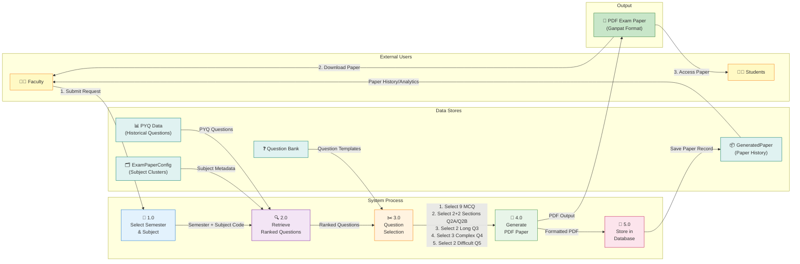

# 🔄 Exam Paper Generator - Level 1 Data Flow Diagram (DFD)

## DFD - System Process Flow (Mermaid)



---

## 📋 Process Descriptions (Context)

### Process 1.0: Select Semester & Subject
**Purpose:** Accept user input for paper generation  
**Input:** Faculty action - selects semester and subject code from dropdown  
**Processing:** Validate input parameters  
**Output:** Semester (1-6) + Subject Code (e.g., "CS101")  
**Data Stores:** None (view layer only)  

**API Endpoint:**
```
GET /exam_paper/get_semesters/  → Returns [1, 2, 3, 4, 5, 6]
GET /exam_paper/get_subjects/{semester}/  → Returns [{"code": "CS101", "name": "Data Structures"}, ...]
POST /exam_paper/generate_paper/  → Triggers Process 1.0 completion
```

---

### Process 2.0: Retrieve & Rank Questions
**Purpose:** Fetch relevant questions from PYQ database and rank by importance  
**Input:** Semester, Subject Code  
**Processing:**
1. Query PYQ Data store for all questions in subject cluster
2. Calculate frequency score:
   - `count`: How many times question appeared
   - `year_count`: How many years it appeared
   - `freq_score`: Importance metric
3. Sort by: (year_count DESC, count DESC, freq_score DESC)

**Output:** Ranked list of questions  
**Data Stores Used:**
- **PYQ_Data** (External source)
- **ExamPaperConfig** (Subject cluster mapping)

**Code Location:** `utils.py` function `get_ranked_questions()`
```python
def get_ranked_questions(semester, subject_code):
    # Access ExamPaperConfig.clusters (loaded from seed data)
    # Filter by semester_subject_code key
    # Sort by frequency metrics
    # Return (all_info, subject_name)
```

---

### Process 3.0: Question Selection Algorithm
**Purpose:** Select specific questions based on exam type  
**Input:** Ranked questions, Exam type (Internal/External)  
**Processing:**

**External Exam (60 marks, 3 hours):**
- Section 1 (MCQ): Select 9 MCQs (1-2 marks each)
- Q2A: Select 2 questions (5-7 marks)
- Q2B: Select 2 questions (5-7 marks)
- Q3: Select 2 long answer questions (8-10 marks)
- Q4: Select 3 complex/problem-solving questions (12-15 marks)
- Q5: Select 2 difficult/application questions (15-20 marks)
- **TOTAL:** 20 questions = 60 marks

**Internal Exam (30 marks, 1.5 hours):**
- Section 1 (MCQ): Select 9 MCQs (1-2 marks)
- Other sections: Optional light assessment
- **TOTAL:** ~9 questions = 30 marks

**Output:** Selected questions in proper order  
**Data Stores Used:** Question Bank (templates for variations)

**Code Location:** `utils.py` function `pick_questions()`
```python
def pick_questions(ranked, n, used):
    # Pick n unique questions from ranked list
    # If insufficient questions, generate variations
    # Return formatted question list with metadata
```

---

### Process 4.0: Generate PDF Exam Paper
**Purpose:** Format selected questions into professional PDF document  
**Input:** Selected questions, Paper metadata (semester, subject, marks, time)  
**Processing:**
1. Create FPDF instance
2. Add Ganpat University header
3. Add exam details:
   - Course code (e.g., BCA SEM-1)
   - Subject name & code
   - Exam type (Internal/External)
   - Time & Total Marks
4. Add instructions (3 standard)
5. Iterate questions:
   - Add question with multiple choice options (if MCQ)
   - Number correctly (A, B, C... or I, II, III...)
   - Add marks indication
6. Format for exact Ganpat template

**Output:** PDF buffer (in-memory file)  
**Data Stores:** None (generation only)

**Code Location:** `utils.py` function `create_pdf()`
```python
def create_pdf(paper):
    # Create FPDF instance
    # Write header: Ganpat University, course, subject
    # Write instructions
    # Iterate paper['section1'], paper['q2a'], etc.
    # Return BytesIO buffer with PDF content
```

---

### Process 5.0: Store in Database & Output
**Purpose:** Save paper generation record and provide download  
**Input:** Paper metadata + complete question structure (paper_data dict)  
**Processing:**
1. Create GeneratedPaper record with:
   - semester
   - subject_code
   - subject_name
   - exam_type
   - total_marks
   - paper_data (full JSON)
   - created_at (auto-timestamp)
2. Save to database
3. Return FileResponse with PDF

**Output:** PDF download + Database record  
**Data Store Used:** GeneratedPaper table  
**Side Effects:** Paper stored for archival and analytics

**Code Location:** `views.py` function `download_pdf()`
```python
@csrf_exempt
def download_pdf(request):
    paper = json.loads(request.body)
    buf = create_pdf(paper)
    
    GeneratedPaper.objects.create(
        semester=paper['semester'],
        subject_code=paper['subject_code'],
        subject_name=paper['subject_name'],
        exam_type=paper['exam_type'],
        total_marks=paper['total_marks'],
        paper_data=paper
    )
    
    return FileResponse(buf, filename=fname)
```

---

## 📊 Data Store Specifications

### D1: PYQ Data (Historical Question Repository)
**Structure:** Dictionary of {semester_subject_code: [questions]}  
**Example Key:** "1_CS101" (Semester 1, Subject CS101)  
**Data per Question:**
```python
{
    'representative': 'Question text',
    'count': 5,           # Repeated 5 times in history
    'years': [2021, 2022, 2023, 2024, 2024],  # Years asked
    'year_count': 4,      # Unique years
    'freq_score': 0.85    # Importance ranking
}
```
**Source:** Imported from CSV/JSON of previous year questions  

### D2: ExamPaperConfig (Subject Metadata)
**Structure:** Python class constants loaded at app startup  
**Example:**
```python
sem_subjects = {
    "1": {
        "CS101": "Data Structures",
        "CS102": "Database Systems",
        "CS103": "Web Development"
    },
    "2": { ... }
}
```
**Usage:** Map semester + subject code to subject name  

### D3: GeneratedPaper (Generation History)
**Database Table:** `generated_papers`  
**Columns:**
- `id` (auto PK)
- `semester` (int)
- `subject_code` (varchar)
- `subject_name` (varchar)
- `exam_type` (varchar: Internal|External)
- `total_marks` (int: 30|60)
- `paper_data` (JSON - complete question structure)
- `created_at` (datetime)

**Purpose:** Archive all generated papers for tracking, re-generation, and analytics

### D4: Question Bank (Question Templates)
**Source:** `QUESTION_VARIATIONS` list in utils.py  
**Usage:** Generate question variations when PYQ questions insufficient

---

## 🔌 System Data Flows (Summary)

```
┌─────────────────────────────────────────────────────────────┐
│ FLOW 1: Faculty Requests Paper Generation                  │
├─────────────────────────────────────────────────────────────┤
│ Faculty → P1.0 → (Sem + SubCode) → P2.0 → Ranked Qs      │
│ Faculty ← P4.0 ← PDF Output ← P3.0 ← Selected Qs          │
└─────────────────────────────────────────────────────────────┘

┌─────────────────────────────────────────────────────────────┐
│ FLOW 2: PYQ Data Processing                                │
├─────────────────────────────────────────────────────────────┤
│ D1 + D2 → P2.0 → Rank & Score → P3.0 → Filter by Type    │
│ D4 → P3.0 → Variations (if needed) → P4.0 → PDF Format    │
└─────────────────────────────────────────────────────────────┘

┌─────────────────────────────────────────────────────────────┐
│ FLOW 3: Persistence & Archival                             │
├─────────────────────────────────────────────────────────────┤
│ P4.0 → PDF + Metadata → P5.0 → Store in D3 (DB)           │
│ D3 → Faculty Analytics (History query)                     │
└─────────────────────────────────────────────────────────────┘
```

---

## ⚙️ Technical Implementation Details

### Question Ranking Algorithm
```python
all_info.sort(key=lambda x: (
    x.get('year_count', 1),      # Priority 1: Appeared in more years
    x['count'],                    # Priority 2: Total frequency
    x.get('freq_score', 0)        # Priority 3: Computed importance
), reverse=True)
```

### Question Variation Generation (Fallback)
When insufficient actual questions (e.g., only 6 MCQs found, need 9):
```python
QUESTION_VARIATIONS = [
    "Explain in detail: ",
    "With a suitable example, describe: ",
    "Write a short note on: ",
    "Critically analyze: ",
    ...
]
# Prefix existing questions with variations to fill gaps
```

### Exam Paper Structure (JSON)
```python
paper = {
    'semester': 1,
    'subject_code': 'CS101',
    'subject_name': 'Data Structures',
    'exam_type': 'External',
    'total_marks': 60,
    'time': '3 Hours',
    'section1': [9 MCQs],
    'q2a': [2 questions],
    'q2b': [2 questions],
    'q3': [2 questions],
    'q4': [3 questions],
    'q5': [2 questions]
}
```

---

## 📝 Summary Table

| Process | Input | Output | Time | Storage |
|---------|-------|--------|------|---------|
| 1.0 | Sem + Code | Parameters | <100ms | - |
| 2.0 | Sem + Code | Ranked Qs | <200ms | PYQ Data |
| 3.0 | Ranked Qs | Selected Qs | <100ms | Question Bank |
| 4.0 | Selected Qs | PDF Buffer | <500ms | Memory |
| 5.0 | PDF + Meta | Saved Record | <100ms | GeneratedPaper DB |
| **Total** | | | **~1 sec** | |
