# Ganpat University ERP — Updated Website Flowchart

This document provides a complete flowchart of the updated Ganpat University ERP website, reflecting the exact routes, components, and current feature sets (including newly added pages and removed/consolidated pages).

## Website Architecture Flowchart

Below is the Mermaid.js flowchart representing the navigational flow of the website. You can view this diagram using any markdown viewer that supports Mermaid (like GitHub, VS Code with appropriate extensions, or by pasting it into [Mermaid Live Editor](https://mermaid.live/)).

```mermaid
graph TD
    %% Main Entry Points
    Start((Website Entry)) --> Home[Home Page '/']
    Start --> PublicPages{Public Info}
    Start --> Logins{Authentication}

    %% Public Pages Flow
    PublicPages --> Academics[Academics Info Page '/academics']
    PublicPages --> About[About Us Page '/about']

    %% Login Branches
    Logins --> UserLogin[Student/Faculty Login '/login']
    Logins --> AdminLogin[Admin Secure Login '/admin/login' or '/admin']

    %% -------------------------------------
    %% STUDENT PORTAL
    %% -------------------------------------
    UserLogin -- "Role: Student" --> StudentPortal{Student Portal}
    
    StudentPortal --> SDash[Dashboard '/student/dashboard']
    SDash -. "Shows" .-> SOverview(Attendance % & Academics Overview)
    
    StudentPortal --> SAttend[Attendance '/student/attendance']
    SAttend -. "Shows" .-> SAttendSub(Subject-wise Attendance records)
    
    StudentPortal --> STimetable[Timetable '/student/timetable']
    STimetable -. "Shows" .-> STimetableGrid(Weekly detailed schedule)
    
    StudentPortal --> SResults[Results & SGPA '/student/results']
    SResults -. "Shows" .-> SResultDocs(Semester wise grades)
    
    StudentPortal --> SPYQ[AI PYQ Generator '/student/pyqs']
    SPYQ -. "Feature" .-> SGenPYQ(Request & download AI exam papers)
    
    StudentPortal --> SCareer[Career Page '/student/career']
    SCareer -. "Styled with" .-> SCareerBG[Ganpat Red Heritage Background]
    SCareer -. "Shows" .-> SCareerInfo(Career planning & placement tools)
    
    StudentPortal --> SProfile[Profile '/student/profile']
    SProfile -. "Shows" .-> SProfileDet(Student personal & academic details)

    %% -------------------------------------
    %% FACULTY PORTAL
    %% -------------------------------------
    UserLogin -- "Role: Faculty" --> FacultyPortal{Faculty Portal}
    
    FacultyPortal --> FDash[Dashboard '/faculty/dashboard']
    FDash -. "Prioritizes" .-> FSchedule(Today's recurring Timetable classes)
    FDash -. "Shows" .-> FOverview(Stats & overview)
    
    FacultyPortal --> FAttend[Classes & Attendance '/faculty/attendance']
    FAttend -. "Feature" .-> FMarkAttend(Mark student attendance manually/ML)
    
    FacultyPortal --> FExams[Exam Papers & Subjects '/faculty/exam-papers']
    FExams -. "Feature" .-> FManageExams(Manage exams & assignments)
    
    FacultyPortal --> FTimetable[Timetable '/faculty/timetable']
    FTimetable -. "Shows" .-> FTimeCourses[Course Names & Class info for slots]
    
    FacultyPortal --> FProfile[Profile '/faculty/profile']
    FProfile -. "Shows" .-> FProfileDet(Faculty personal & dept details)

    %% -------------------------------------
    %% ADMIN PORTAL
    %% -------------------------------------
    AdminLogin -- "Authenticated" --> AdminPortal{Admin Portal}
    
    AdminPortal --> ADash[Dashboard '/admin/dashboard']
    ADash -. "Shows" .-> ASystemOverview(System-wide metrics & quick links)
    
    AdminPortal --> AStudents[Manage Students '/admin/students']
    AStudents -. "Feature" .-> AManageS(Add/Edit student records)
    
    AdminPortal --> AFaculty[Manage Faculty '/admin/faculty']
    AFaculty -. "Feature" .-> AManageF(Add/Edit faculty records)
    
    AdminPortal --> ACourses[Manage Courses '/admin/courses']
    ACourses -. "Feature" .-> AManageC(Course & Subject configurations)
    
    AdminPortal --> ATimetable[Timetable Manager '/admin/timetable']
    ATimetable -. "Layout updated" .-> ATimeSpace[Proper vertical spacing added]
    ATimetable -. "Feature" .-> AManageTime(Assign faculty & rooms to class slots)
    
    AdminPortal --> ACycle[Academic Cycle '/admin/academic-cycle']
    ACycle -. "Feature" .-> AManageCycle(Manage semesters & terms)
    
    AdminPortal --> ANotes[Notifications '/admin/notifications']
    ANotes -. "Feature" .-> AManageNotes(Broadcast system alerts/news)

    %% Styling for visual hierarchy
    classDef portal fill:#f9f,stroke:#333,stroke-width:2px;
    classDef default fill:#fff,stroke:#666,stroke-width:1px;
    classDef feature fill:#eef,stroke:#99f,stroke-width:1px,stroke-dasharray: 5 5;
    classDef styling fill:#ffe4e1,stroke:#f08080,stroke-width:1px,stroke-dasharray: 5 5;
    
    class StudentPortal,FacultyPortal,AdminPortal portal;
    class SOverview,SAttendSub,STimetableGrid,SResultDocs,SGenPYQ,SCareerInfo,SProfileDet feature;
    class FSchedule,FOverview,FMarkAttend,FManageExams,FTimeCourses,FProfileDet feature;
    class ASystemOverview,AManageS,AManageF,AManageC,AManageTime,AManageCycle,AManageNotes feature;
    class SCareerBG styling;
```

---

## Detailed Navigation Structure

This outline acts as a text-based version of the flowchart, categorized by user flow.

### 1. Public Facing End
*   `/` -> **Home Page**
*   `/about` -> **About Us**
*   `/academics` -> **Academics Overview**
*   `/login` -> **User Login Portal** (For Students & Faculty)
*   `/admin/login` or `/admin` -> **Admin Secure Login**

### 2. Student Portal Routes
Requires authentication with `role: student`.
*   `/student/dashboard` -> Main overview of current semester progress and attendance.
*   `/student/attendance` -> Detailed view of attendance records.
*   `/student/timetable` -> Weekly class schedule.
*   `/student/results` -> Marks and SGPA metrics.
*   `/student/pyqs` -> **AI PYQ Generator** (Generate previous year questions for practice).
*   `/student/career` -> Career services & job placement guidance **(Updated with standard red background styling)**.
*   `/student/profile` -> View student profile details.

### 3. Faculty Portal Routes
Requires authentication with `role: faculty`.
*   `/faculty/dashboard` -> Overview of total students, today's schedule **(Prioritizes recurring timetable slots for accurate daily schedules)**.
*   `/faculty/attendance` -> Managing class sessions and marking student attendance.
*   `/faculty/exam-papers` -> Managing exams, assignments, and generating question papers.
*   `/faculty/timetable` -> Faculty's weekly teaching schedule **(Updated to show course name/code to identify classes clearly)**.
*   `/faculty/profile` -> View faculty profile details.

### 4. Admin Portal Routes
Requires authentication with `role: admin`.
*   `/admin/dashboard` -> High-level system overview and metrics.
*   `/admin/students` -> CRUD operations for student records.
*   `/admin/faculty` -> CRUD operations for faculty records.
*   `/admin/courses` -> Manage Academic programs and Subjects.
*   `/admin/timetable` -> Overall timetable manager to create and verify slots **(Styling updated for better layout)**.
*   `/admin/academic-cycle` -> Manage terms and academic periods.
*   `/admin/notifications` -> Create and dispatch system-wide announcements.
